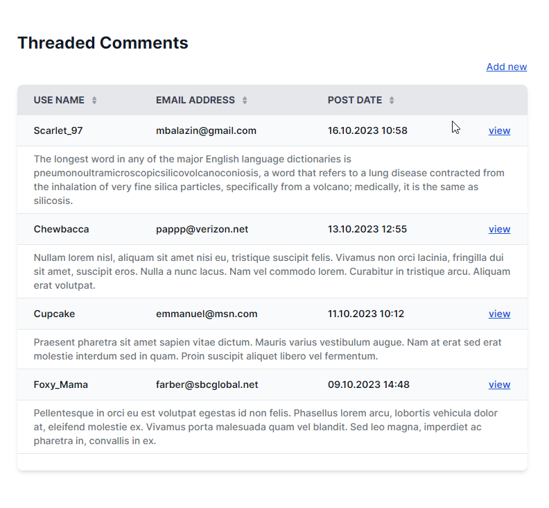

# threaded-comments 

Demo Laravel Application.

### Install

Clone or download this [repository](https://github.com/zares/threaded-comments).

```bash
cd threaded-comments
```
```bash
composer install
```
```bash
php artisan migrate --seed
```
```bash
php artisan app:install
```
### Run

```bash
php artisan serve
```
---


